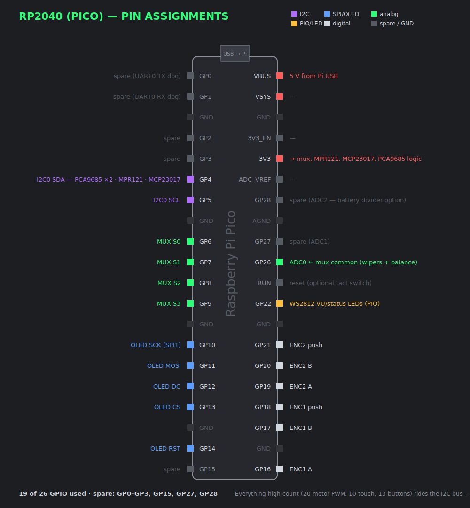
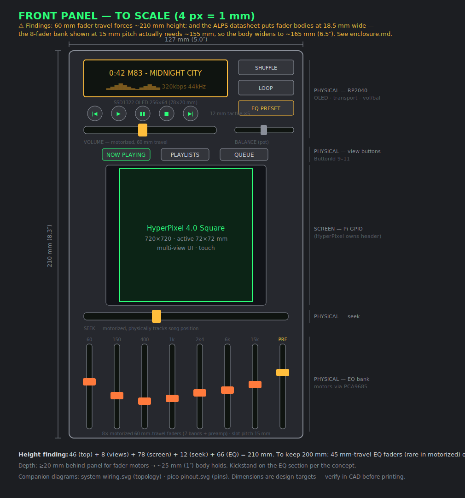

# Wiring & physical layout

## Schematics

| Diagram | What it shows |
|---|---|
| [**System wiring**](diagrams/system-wiring.svg) | Full power + data topology: battery → UPS → Pi/motor rail; USB to the RP2040 + DAC; the I2C expander bus (PCA9685/MPR121/MCP23017) out to the faders |
| [**Pico pinout**](diagrams/pico-pinout.svg) | Every RP2040 pin assignment (19 of 26 used, spares marked) |
| [**Front panel**](diagrams/front-panel.svg) | To-scale (4 px/mm) control layout with dimensions — includes the 210 mm height finding |






> ⚠️ **Dimension findings** (from the to-scale drawing + the ALPS datasheet):
> 60 mm fader travel pushes the body to **~210 mm tall**; fader bodies are
> **18.5 mm wide × 26 mm deep**, so the 8-fader bank needs **~155 mm of width**
> and the body **~32 mm of depth** — working envelope is now **~165 × 210 × 32 mm
> (6.5″ × 8.3″ × 1.25″)**. Full analysis + options: [enclosure.md](enclosure.md).
> Finalize in CAD (Phase 8).

## Front-panel layout (ASCII summary, portrait ≈127 × 210 mm)

Mirrors the software's regions so the code and the hardware agree:

```
┌───────────────────────────────────────────┐  ← ~127 mm wide
│  WINAMP · PHYSICAL EDITION       (title)   │
├───────────────────────────────────────────┤
│  0:42   [ amber OLED readout ]   320 kbps  │   PHYSICAL panel
│  ░░▓▓██▓░ title + spectrum       44 kHz    │   SSD1322 256×64 SPI OLED on the
│  |◀ ▶ ▮▮ ■ ▶| SHUF LOOP PRESET [==BAL==]   │   RP2040 (`DISP` commands) +
│  [====VOL (motorized)====]                 │   buttons + balance pot + volume
├───────────────────────────────────────────┤
│  [NP] [PL] [Q]  (view-switch buttons)     │   PHYSICAL (ButtonId 9–11)
│   ┌─────────────────────────────┐         │
│   │                             │         │   SCREEN
│   │   HyperPixel 4.0 Square     │         │   720×720 DPI touchscreen
│   │   (multi-view UI: now       │         │   ⚠ occupies ALL 40 GPIO —
│   │   playing/playlists/queue)  │         │   controls/battery on RP2040,
│   └─────────────────────────────┘         │   audio via USB DAC
│                                           │
├───────────────────────────────────────────┤
│  EQ:  ▮ ▮ ▮ ▮ ▮ ▮ ▮   ▮(pre)              │   PHYSICAL panel
│      60 150 400 1k 2k4 6k 15k              │   8 motorized 60 mm faders
├───────────────────────────────────────────┤
│  [====VOL====]      [====SEEK====]         │   2 motorized faders (horizontal)
└───────────────────────────────────────────┘
```

## Pico (RP2040) pin plan — expander architecture

**Direct-wiring does not fit**: 10 motors × 2 PWM + 10 touch + 13 buttons +
mux + encoders ≈ **55 signals vs the Pico's 26 GPIO**. Everything high-count
rides one I2C bus instead:

```
                        ┌── PCA9685 #1 ──▶ DRV8833 ×3 ──▶ fader motors 0–5
Pico I2C (2 pins) ──────┼── PCA9685 #2 ──▶ DRV8833 ×2 ──▶ fader motors 6–9
                        ├── MPR121  ──▶ 10 fader touch-sense lines
                        └── MCP23017 ──▶ 13 panel buttons
```

| Function | Pico pins | Count |
|---|---|---|
| I2C bus (PCA9685 ×2, MPR121, MCP23017) | GP4/GP5 | 2 |
| Mux (CD74HC4067) select S0–S3 | GP6–GP9 | 4 |
| Mux common out → ADC (wipers + balance pot) | GP26 (ADC0) | 1 |
| OLED readout (SSD1322, SPI + DC/CS/RST) | GP10–GP14 | 5 |
| Encoders (EC11) ×2 + push | GP16–GP21 | 6 |
| WS2812 LEDs | GP22 (PIO) | 1 |
| USB | to Pi (CDC serial + power) | — |
| **Total** | | **19 of 26** ✅ |

Each motorized fader needs **three** connections handled together:
1. **Motor** → a DRV8833 channel, its two inputs driven by PCA9685 outputs.
2. **Wiper** → a mux input → ADC, for the PID's position feedback.
3. **Touch** → an MPR121 electrode, so the Pi knows to stop driving it.

> **PWM-frequency caveat:** the PCA9685 tops out at ~1.5 kHz, which is audible as
> a faint buzz *while a fader is moving*. Moves last well under a second, and the
> **reduced build** (only volume + seek motorized, driven directly from Pico PWM
> pins at 20 kHz+) sidesteps it completely.

## Control loop (firmware)

Per motorized fader, ~1 kHz:

```
error = target - read_position(fader)
if touched(fader):        # user wins
    motor_off(fader); report EV FADER when it settles
else:
    drive = PID(error)    # tune Kp/Ki/Kd per fader
    motor_pwm(fader, clamp(drive))
```

See `firmware/src/main.cpp` for the skeleton.

## Power & audio

- LiPo → power board (5 V boost) → Pi 4; motors get their own regulated rail off
  the same pack (H-bridges draw spikes — decouple well, keep motor ground and
  logic ground joined at one star point).
- **USB DAC** on a Pi USB port → 3.5 mm headphone jack (the HyperPixel's DPI
  takes the I2S pins, so no GPIO DAC); optional PAM8302 + small speaker for a
  built-in speaker. Pi USB budget: RP2040 + DAC = 2 of 4 ports.

## Enclosure

- Book form, ~200 × 127 × 25 mm. Faders and their travel set the depth — 60 mm
  faders + motor bodies are the tallest components; plan ~20 mm behind the panel.
- Print the front panel with slots for fader travel and cutouts for the LCD,
  buttons, and encoders. A kickstand echoes the Yanko concept's EQ-base stand.
- CAD lives here later (`hardware/cad/`), source + STL.
